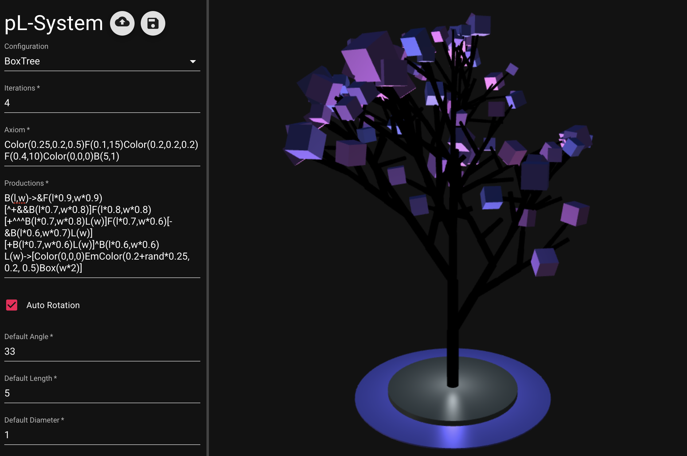

# elvis

_easy l-system visualization._

JS implementation of a parametric l-system rewriting engine with interactive editor and visualization.




## Features

* Visualization of 3D and 2D l-systems
* Optional parameters (pL-System)
* Randomization with the `rand`-keyword. Can be used in a conditions for stochastic l-systems.
* Multi-character symbol possibilities, like the Color(r,g,b) symbol
* Interactive parameter editor to open and save current parameters in json-format
* Automatic camera on the object boundary
* Trackball navigation with possible autorotation
* Lighting parametrization via configuration file
* Optimized for mobile devices

## Getting Started

Try it out here or clone this repo and start it as follows:

```bash
npm install       # Install project dependencies
npm start         # Compile and launch (same as `yarn start`)
```


## Syntax

The production rules are in the following format:

```bash
Symbol: Optional Condition -> New Symbols
```

A symbol can have multiple parameters. The condition and the parameters of new symbols are evaluated by math.js. See the math.js documentation for syntax and available functions. Currently, mathematical expressions are limited in the usage of brackets since they are interfering with the symbol parameter brackets.

The following symbols are parsed by the turtle:

| Function         | Description |
|------------------|-------------|
| F, F(l), F(l,d)  | Creates a tube with length l, diameter d in the current color and sets the turtle to the end of the tube. A Diameter of 0 results in a white line|
| f, f(l)          | Move the turtle forward by the distance l |
| Box(l)           | Creates a cube with length l, but leaves the turtle at the current position |
| Color(r,g,b)     | Sets the current color of the turtle |
| Color            | Resets the current color of the turtle |
| EmColor(r,g,b)   | Sets the current emissive color of the turtle |
| /, /(d)          | Rotates the turtle d degrees positively around the X-Axis |
| \\, \\(d)        | Rotates the turtle d degrees negatively around the X-Axis |
| &, &(d)          | Rotates the turtle d degrees positively around the Y-Axis |
| ^, ^(d)          | Rotates the turtle d degrees negatively around the Y-Axis |
| +, +(d)          | Rotates the turtle d degrees positively around the Z-Axis |
| -, -(d)          | Rotates the turtle d degrees negatively around the Z-Axis |
| &#124;           | Rotates the turtle 180 degrees around the Z-Axis |
| $                | Sets the direction of the turtle upwards |
| [                | Pushes the current turtle state on the stack |
| ]                | Pops the current turtle stack from the stack |

If a parameter is left out the default parameters from the GUI are taken.

## Built With

* [Babylon.JS](https://www.babylonjs.com/)
* [React](https://reactjs.org/)
* [Material-UI](https://material-ui.com/)
* [math.js](https://mathjs.org/)
* [react-babylonjs](https://github.com/brianzinn/react-babylonjs)
* [React Split Pane](https://github.com/tomkp/react-split-pane)

## Author

* **Timon Höbert**

## License

This project is licensed under the GNU GPLv3 - see the [gpl-3.0.md](gpl-3.0.md) file for details

## Acknowledgments

* Thanks to Mr. Doob for the inspiration of the tree sculpture.